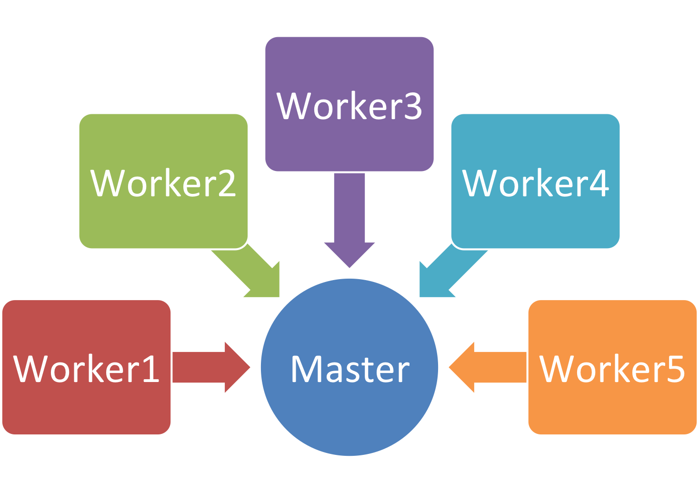
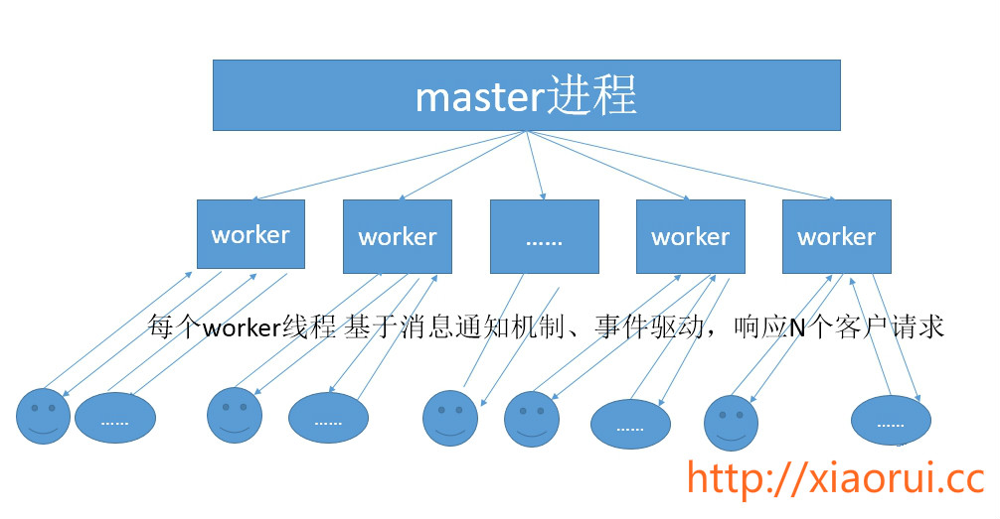

# 项目名:
`ProcessHandler`

ProcessHandler是基于gunicorn改造开发的进程管理框架, 主要摘除了wsgi协议层，加强了一些列进程管理的功能.

### 功能列表
- [x] daemon mode
- [x] 重写进程名
- [x] 动态增减进程
- [x] 配置重载
- [x] 配置写入
- [x] 多实例锁
- [x] pypy支持
- [x] accept锁分离
- [x] 主动重启worker
- [x] 可封装msgpack-rpc
- [x] 回收僵尸及孤儿进程
- [  ] worker友好退出
- [  ] cpu bind绑定
- [  ] 分布式锁控制主备
- [  ] 协程及线程接口

## 用途:
简单理解为这是一个` Master Worker `框架. 可以说跟nginx的进程管理模式有些类似.

## 工作原理: 
当ProcessHandle启动后，会有一个master进程和多个worker进程.master进程主要用来管理worker进程，包含：接收来自外界的信号，向各worker进程发送信号，监控worker进程的运行状态，当worker进程退出后(异常情况下)，会自动重新启动新的worker进程.   
对于每个worker进程来说，独立的进程，不需要加锁，所以省掉了锁带来的开销，同时在编程以及问题查找时，也会方便很多。其次，采用独立的进程，可以让互相之间不会影响，一个进程退出后，其它进程还在工作，服务不会中断，master进程则很快启动新的worker进程。当然，worker进程的异常退出，肯定是程序有bug了，异常退出，会导致当前worker上的所有请求失败，不过不会影响到所有请求，所以降低了风险。当然，好处还有很多，大家可以慢慢体会。  




----

## 文档说明

配置文件说明 config.py:
```
[DEFAULT]
#当收到kill信号后,几秒后干掉worker
graceful_timeout        = 3

#应用的环境变量
base_path               = . 

#日志根目录
log_path                = .

#是否支持多实例
single_instance         = false

[jobexecute]
#是否需要扔到后端
daemonize               = true

#进程名字
proc_name               = jobexecute

#Master主进程PID
pidfile                 = %(base_path)s/master.pid

#日志位置
log_file                = %(log_path)s/master.log

#最大的请求数,也可以理解为是调用测试
max_requests            = 10000

#启动的进程数目,每个进程都是一个实例
number_workers          = 2

```
----

##使用方法:

首先需要安装ProcessHandler所需要的关联模块,尽量使用标准库来实现.

```
pip install requirement.txt
```

下面是主要处理任务模块.  根据自己的场景，直接copy代码就可以了.

```
# coding=utf-8

import time
import logging
import traceback

from ProcessHandler.lib.log import setup_file_logging
from ProcessHandler.lib.workers.sync import SyncWorker


class JobExecute(SyncWorker):

    LOGGER_NAME = "jobexecute"

    def __init__(self, cfg, file_logger=None, ppid=None, sockets=None):
        SyncWorker.__init__(self, cfg, file_logger, ppid)
        setup_file_logging(self.LOGGER_NAME, self.cfg.log_file)
        self.logger = logging.getLogger(self.LOGGER_NAME)

    def setup(self):
        super(JobExecute, self).setup()

    def init_process(self):
        super(JobExecute, self).init_process()

    def stop(self):
        super(JobExecute, self).stop()

    def handle_request(self):
        while 1:
            print 'go....'
            logger.info('go...')
            time.sleep(1.5)

if __name__ == '__main__':
    pass
```

